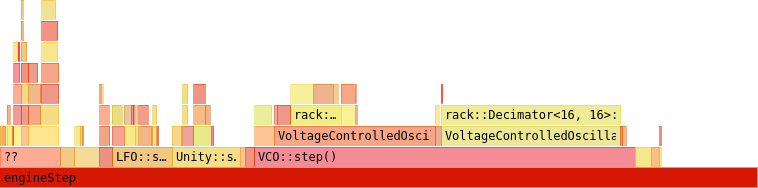

# DSP

Digital signal processing (DSP) is the field of mathematics and programming regarding the discretization of continuous signals in time and space.
One of its many applications is to generate and process audio from virtual/digital modular synthesizers.

There are many online resources and books for learning DSP.

- [Digital signal processing Wikipedia](https://en.wikipedia.org/wiki/Digital_signal_processing): An overview of the entire field.
- [Julius O. Smith III Online Books](https://ccrma.stanford.edu/~jos/) ([Index](https://ccrma.stanford.edu/~jos/GlobalJOSIndex.html)): Thousands of topics on audio DSP and relevant mathematics, neatly organized into easy-to-digest but sufficiently deep pages and examples.
	- [Mathematics of the Discrete Fourier Transform (DFT)](https://ccrma.stanford.edu/~jos/mdft/)
	- [Introduction to Digital Filters](https://ccrma.stanford.edu/~jos/filters/)
	- [Physical Audio Signal Processing](https://ccrma.stanford.edu/~jos/pasp/)
	- [Spectral Audio Signal Processing](https://ccrma.stanford.edu/~jos/sasp/)
- [Seeing Circles, Sines, and Signals](https://jackschaedler.github.io/circles-sines-signals/): A visual and interactive introduction to DSP.
- [The Scientist and Engineer's Guide to Digital Signal Processing](http://dspguide.com/) by Steven W. Smith: Free online book covering general DSP topics.
- [The Art of VA Filter Design](http://www.native-instruments.com/fileadmin/ni_media/downloads/pdf/VAFilterDesign_2.0.0a.pdf) (PDF) by Vadim Zavalishin: Huge collection of deep topics in digital/analog filter design and analog filter modeling.
- [DSPRelated.com](https://www.dsprelated.com/): Articles, news, and blogs about basic and modern DSP topics.
- [Digital Signal Processing MIT OpenCourseWare](https://ocw.mit.edu/resources/res-6-008-digital-signal-processing-spring-2011/): Video lectures and notes covering the basics of DSP.
- [KVR Audio Forum - DSP and Plug-in Development](http://www.kvraudio.com/forum/viewforum.php?f=33): Music DSP and software development discussions.
- [Signal Processing Stack Exchange](https://dsp.stackexchange.com/): Questions and answers by thousands of DSP professionals and amateurs.

The following topics are targeted toward modular synthesizer signal processing, in which designing small but precise synthesizer components is the main objective.

This document is currently a *work-in-progress*.
Remember that if anything here is inaccurate, you can [edit it yourself](https://github.com/VCVRack/manual) or [open an issue](https://github.com/VCVRack/manual/issues) in the manual's source repository.
Image credits are from Wikipedia.

## Signals

A *signal* is a function \\(x(t): \mathbb{R} \rightarrow \mathbb{R}\\) of amplitudes (voltages, sound pressure levels, etc.) defined on a time continuum, and a *sequence* is a function \\(x(n): \mathbb{Z} \rightarrow \mathbb{R}\\) defined only at integer points, often written as \\(x_n\\).
In other words, a signal is an infinitely long continuum of values with infinite time detail, and a sequence is an infinitely long stream of samples at evenly-spaced isolated points in time.

Analog hardware produces and processes signals, while digital algorithms handle sequences of samples (often called *digital signals*.)

### Fourier analysis

In DSP you often encounter periodic signals that repeat at a frequency \\(f\\), like cyclic waveforms.
Periodic signals are composed of multiple harmonics (shifted cosine waves) with frequencies \\(fk\\) for \\(k = 1, 2, 3, \ldots\\).
In fact, a periodic signal can be *defined* by the amplitudes and phases of all of its harmonics.
For simplicity, if \\(x(t)\\) is a periodic signal with \\(f=1\\), then
\\[
	x(t) = A_0 + \sum_{k=1}^\infty A_k \cos \left( 2\pi k t + \phi_k \right)
\\]
where \\(A_0\\) is the *DC component* (the signal's average offset from zero), \\(A_k\\) is the amplitude of harmonic \\(k\\), and \\(\phi_k\\) is its angular phase.
Each term of the sum is a simple harmonic signal, and when superimposed, they reconstruct the original signal.

As it turns out, not only periodic signals but *all* signals have a unique decomposition into shifted cosines.
However, instead of integer harmonics, you must consider all frequencies \\(f\\), and instead of a discrete sum, you must integrate over all shifted cosines of real-numbered frequencies.
Furthermore, it is easier to combine the amplitude and phase into a single complex-valued component \\(X(f) = A(f) e^{i \phi(f)}\\).
With these modifications, the decomposition becomes
\\[
	x(t) = \int_{-\infty}^\infty X(f) e^{2\pi i t f} df
\\]
The \\(X(f)\\) component can be calculated with
\\[
	X(f) = \int_{-\infty}^\infty x(t) e^{-2\pi i t f} dt
\\]
This is known as the [Fourier transform](https://en.wikipedia.org/wiki/Fourier_transform).

For a digital periodic signal with period \\(N\\), no harmonics above \\(N/2\\) can be represented, so its decomposition is truncated.
\\[
	x_k = \sum_{n=0}^{N/2} X_n e^{2\pi i kn / N}
\\]
Its inverse is
\\[
	X_n = \sum_{k=0}^{N} x_k e^{-2\pi i kn / N}
\\]
Since the sequence \\(x_k\\) is real-valued, the components \\(X_n\\) are conjugate symmetric across \\(N/2\\), i.e. \\(X_n = X_{N-n}^\ast\\), so we have \\(N/2 + 1\\) unique harmonic components.
This is the (real) [discrete Fourier transform](https://en.wikipedia.org/wiki/Discrete_Fourier_transform) (DFT).

The [fast Fourier transform](https://en.wikipedia.org/wiki/Fast_Fourier_transform) (FFT) is a method that surprisingly computes the DFT of a block of \\(N\\) samples in \\(O(N \log N)\\) steps rather than \\(O(N^2)\\) like the DFT by using a recursive [dynamic programming](https://en.wikipedia.org/wiki/Dynamic_programming) algorithm, while being more numerically stable than the naive sum.
This makes the DFT feasible in high-performance DSP when processing blocks of samples.
The larger the block size, the lower the average number of steps required per sample.
FFT algorithms exist in many libraries, like [pffft](https://bitbucket.org/jpommier/pffft/) used in VCV Rack itself.

### Sampling

The [Nyquist–Shannon sampling theorem](https://en.wikipedia.org/wiki/Nyquist%E2%80%93Shannon_sampling_theorem) states that a signal with no frequency components higher than half the sample rate \\(f_{sr}\\) can be sampled and reconstructed without losing information.
In other words, if you bandlimit a signal (with a brick-wall lowpass filter at \\(f_{sr}/2\\)) and sample points at \\(f_{sr}\\), you can reconstruct the bandlimited signal by finding the unique signal which passes through all points and has no frequency components higher than \\(f_{sr}/2\\).

In practice, analog-to-digital converters (ADCs) apply an approximation of a brick-wall lowpass filter to remove frequencies higher than \\(f_{sr}/2\\) from the signal.
The signal is integrated for a small fraction of the sample time \\(1/f_{sr}\\) to obtain an approximation of the amplitude at a point in time, and this measurement is quantized to the nearest digital value.

Digital-to-analog converters (DACs) convert a digital value to an amplitude and hold it for a fraction of the sample time.
A [reconstruction filter](https://en.wikipedia.org/wiki/Reconstruction_filter) is applied, producing a signal close to the original bandlimited signal.
High-quality ADCs may include digital upsampling before reconstruction.
[Dithering](https://en.wikipedia.org/wiki/Dither) may be done but is mostly unnecessary for bit depths higher than 16.

Of course, noise may also be introduced in each of these steps.
Fortunately, modern DACs and ADCs as cheap as $2-5 per chip can digitize and reconstruct a signal with a variation beyond human recognizability, with signal-to-noise (SNR) ratios and total harmonic distortion (THD) lower than -90dBr.

### Aliasing

The Nyquist–Shannon sampling theorem requires the original signal to be bandlimited at \\(f_{sr}/2\\) before digitizing.
If it is not, reconstructing will result in an entirely different signal, which usually sounds ugly and is associated with poor-quality DSP.

Consider the high-frequency sine wave in red.
If the signal is sampled every integer, its unique reconstruction is the signal in blue, which has completely different harmonic content as the original signal.
If correctly bandlimited, the original signal would be zero (silence), and thus the reconstruction would be zero.

A square wave has harmonic amplitudes \\(\frac{1}{k}\\) for odd harmonics \\(k\\).
However, after bandlimiting, all harmonics above \\(f_{sr}/2\\) become zero, so its reconstruction should look like this.

The curve produced by a bandlimited discontinuity is known as the [Gibbs phenomenon](https://en.wikipedia.org/wiki/Gibbs_phenomenon).
A DSP algorithm attempting to model a jump found in sawtooth or square waves must include this effect, such as by inserting a minBLEP or polyBLEP signal for each discontinuity.
Otherwise, higher harmonics, like the high-frequency sine wave above, will pollute the spectrum below \\(f_{sr}/2\\).

Even signals containing no discontinuities, such as a triangle wave with harmonic amplitudes \\((-1)^k / k^2\\), must be correctly bandlimited or aliasing will occur.
One possible method is to realize that a triangle wave is an integrated square wave, and an integrator is just a filter with a -20dB per [decade](https://en.wikipedia.org/wiki/Decade_%28log_scale%29) slope.
Since linear filters commute, a bandlimited integrated square wave is just an integrated bandlimited square wave.

The most general approach is to generate samples at a high sample rate, apply a FIR or polyphase filter, and downsample by an integer factor (known as decimation).

For more specific applications, more advances techniques exist for certain cases.
Anti-aliasing is required for many processes, including waveform generation, waveshaping, distortion, saturation, and typically all nonlinear processes.
It is sometimes *not* required for reverb, linear filters, audio-rate FM of sine signals (which is why primitive digital chips in the 80's were able to sound reasonably good), adding signals, and most other linear processes.

## Linear filters

A linear filter is a operation that applies gain depending on a signal's frequency content, defined by
\\[
	Y(s) = H(s) X(s)
\\]
where \\(s = i \omega\\) is the complex angular frequency, \\(X\\) and \\(Y\\) are the [Laplace transforms](https://en.wikipedia.org/wiki/Laplace_transform) of the input signal \\(x(t)\\) and output signal \\(y(t)\\), and \\(H(s)\\) is the [transfer function](https://en.wikipedia.org/wiki/Transfer_function) of the filter, defining its character.
Note that the [Fourier transform](https://en.wikipedia.org/wiki/Fourier_transform) is not used because of time causality, i.e. we do not know the future of a signal.
The filter is "linear" because the filtered sum of two signals is equal to the sum of the two individually filtered signals.

A log-log plot of \\(H(i \omega)\\) is called a [Bode plot](https://en.wikipedia.org/wiki/Bode_plot).

To be able to exploit various mathematical tools, the transfer function is often written as a rational function in terms of \\(s^{-1}\\)
\\[
	H(s) = \frac{\sum_{p=0}^P b_p s^{-p}}{\sum_{q=0}^Q a_q s^{-q}}
\\]
where \\(a_q\\) and \\(b_p\\) are called the *analog filter coefficients*.
With sufficient orders \\(P\\) and \\(Q\\) of the numerator and denominator polynomial, you can approximate most linear analog filters found in synthesis.

To digitally implement a transfer function, define \\(z\\) as the operator that transforms a sample \\(x_n\\) to its following sample, i.e. \\(x_{n+1} = z[x_n]\\).
We can actually write this as a variable in terms of \\(s\\) and the sample time \\(T = 1/f_{sr}\\).
(Consider a sine wave with angular frequency \\(\omega\\). The \\(z\\) operator shifts its phase as if we delayed by \\(T\\) time.)
\\[
	z = e^{sT}
\\]

A first order approximation of this is
\\[
	z = \frac{e^{sT/2}}{e^{-sT/2}} \approx \frac{1 + sT/2}{1 - sT/2}
\\]
and its inverse is
\\[
	s = \frac{1}{T} \ln{z} \approx \frac{2}{T} \frac{1 - z^{-1}}{1 + z^{-1}}
\\]

This is known as the [Bilinear transform](https://en.wikipedia.org/wiki/Bilinear_transform).
In digital form, the rational transfer function is written as
\\[
	H(z) = \frac{\sum_{n=0}^N b_n z^{-n}}{\sum_{m=0}^M a_m z^{-m}}
\\]
Note that the orders \\(N\\) and \\(M\\) are not necessarily equal to the orders \\(P\\) and \\(Q\\) of the analog form, and we obtain a new set of numbers \\(a_m\\) and \\(b_n\\) called the *digital filter coefficients*.

The *zeros* of the filter are the nonzero values of \\(z\\) which give a zero numerator, and the *poles* are the nonzero values of \\(z\\) which give a zero denominator.
A linear filter is stable (its [impulse response](https://en.wikipedia.org/wiki/Impulse_response) converges to 0) if and only if all poles lie strictly within the complex unit circle, i.e. \\(|z| < 1\\).

We should now have all the tools we need to digitally implement any linear analog filter response \\(H(s)\\) and vise-versa.

### IIR filters

An infinite impulse response (IIR) filter is a digital filter that implements all possible rational transfer functions.
By multiplying the denominator of the rational \\(H(z)\\) definition above on both sides and applying it to an input \\(x_k\\) and output \\(y_k\\), we obtain the difference relation
\\[
	\sum_{m=0}^M a_m y_{k-m} = \sum_{n=0}^N b_n x_{k-n}
\\]
Usually \\(a_0\\) is normalized to 1, and \\(y_k\\) can be written explicitly.
\\[
	y_k = \sum_{n=0}^N b_n x_{k-n} - \sum_{m=1}^M a_m y_{k-m}
\\]
This iterative process can be computed for each sample

For \\(N, M = 2\\), this is a [biquad filter](https://en.wikipedia.org/wiki/Digital_biquad_filter), which is very fast, numerically stable (assuming the transfer function itself is mathematical stable), and a reasonably good sounding filter.

\\[
	H(z) = \frac{b_0 + b_1 z^{-1} + b_2 z^{-2}}{1 + a_1 z^{-1} + a_2 z^{-2}}
\\]

### FIR filters

A finite impulse response (FIR) filter is a specific case of an IIR filter with \\(M = 0\\) (a transfer function denominator of 1). For an input and output signal, the difference relation is
\\[
	y_k = \sum_{n=0}^N b_n x_{k-n}
\\]
They are computationally straightforward and always stable since they have no poles.

Long FIR filters (\\(N \geq 128\\)) like FIR reverbs (yes, they are just linear filters) can be optimized through FFTs.
Note that the above formula is the convolution between vectors \\(y\\) and \\(b\\), and by the [convolution theorem](https://en.wikipedia.org/wiki/Convolution_theorem),
\\[
	y \ast b = \mathcal{F}^{-1} \{ \mathcal{F}\{y\} \cdot \mathcal{F}\{b\} \}
\\]
where \\(\cdot\\) is element-wise multiplication.

While the naive FIR formula above requires \\(O(N)\\) computations per sample, the FFT FIR method requires an average of \\(O(\log N)\\) computations per sample when processing blocks of \\(N\\) samples.
A disadvantage of the FFT FIR method is that the signal must be delayed by \\(N\\) samples before any output can be determined.
You can combine the naive and FFT methods into a hybrid approach with the [overlap-add](https://en.wikipedia.org/wiki/Overlap%E2%80%93add_method) or [overlap-save](https://en.wikipedia.org/wiki/Overlap%E2%80%93save_method) methods, allowing you to process smaller blocks of size \\(M < N\\) at a slightly worse \\(O((N/M) \log M)\\) average computations per sample.

### Impulse responses

Sometimes we need to simulate non-rational transfer functions.
Consider a general transfer function \\(H(f)\\), written in terms of \\(f\\) rather than \\(s\\) for simplicity.
Our original definition of a transfer function for an input \\(x(t)\\) and output \\(y(t)\\) is
\\[
	Y(f) = H(f) X(f)
\\]
and by applying the convolution theorem again, we obtain
\\[
	y(t) = (h \ast x)(t) = \int_{-\infty}^\infty h(\tau) x(t - \tau) d\tau
\\]
where \\(h(t)\\) is the *impulse response* of our filter.

The signal \\(h(t)\\) is the result of processing a [delta function](https://en.wikipedia.org/wiki/Dirac_delta_function) through our filter, since \\(\delta(t)\\) is the "identity" function of convolution, i.e. \\(h(t) = (h \ast \delta)(t)\\).
Clapping your hands or popping a balloon (both good approximations of \\(\delta\\)) in a large cathedral will generate a very sophisticated impulse response, which can be recorded as \\(h(t)\\) and processed in a FIR filter algorithm to reproduce arbitrary sounds as if they were performed in the cathedral.

Repeating this process in the digital realm gives us the discrete convolution.
\\[
	y_k = \sum_{n=-\infty}^\infty h_n x_{k-n}
\\]

### Brick-wall filter

An example of a non-rational transfer function is the ideal lowpass filter that fully attenuates all frequencies higher than \\(f_c\\) and passes all frequencies below \\(f_c\\).
Including [negative frequencies](https://en.wikipedia.org/wiki/Negative_frequency), its transfer function is
\\[

H(f) = \begin{cases}
	1 & \text{if } -f_c \leq f \leq f_c \\\\
	0 & \text{otherwise}
\end{cases}

\\]
The inverse Fourier transform of \\(H(f)\\) is
\\[
	h(t) = 2 f_c \operatorname{sinc}(2 f_c t)
\\]
where \\(\operatorname{sinc}(x) = \sin(\pi x) / (\pi x)\\) is the [normalized sinc function](https://en.wikipedia.org/wiki/Sinc_function).

### Windows

Like the brick-wall filter above, many impulse responses \\(h_n\\) are defined for all integers \\(n\\), so they are both non-causal (requires future knowledge of \\(x(t)\\) to compute \\(y(t)\\)) and infinitely long.

*TODO*

### Minimum phase systems
*TODO*

#### MinBLEP
*TODO*

#### PolyBLEP
*TODO*

## Circuit modeling

While not directly included the field of DSP, analog circuit modeling is necessary for emulating the sound and behavior of analog signal processors with digital algorithms.
Instead of evaluating a theoretical model of a signal processing concept, circuit modeling algorithms simulate the voltage state of physical electronics (which itself might have been built to approximate a signal processing concept.)
Each component of a circuit can be modeled with as little or as much detail as desired, of course with trade-offs in complexity and computational time.

Before attempting to model an circuit, it is a good idea to write down the schematic and understand how it works in the analog domain.
This allows you to easily omit large sections of the circuit that offer nothing in sound character but add unnecessary effort in the modeling process.

### Nodal analysis
*TODO*

### Numerical methods for ODEs

A system of ODEs (ordinary differential equations) is a vector equation of the form
\\[
	\vec{x}'(t) = f(t, \vec{x}).
\\]
Higher order ODEs like \\(x'\'(t) = -x(t)\\) are supported by defining intermediate variables like \\(x_1 = x'\\) and writing
\\[
	\begin{bmatrix} x \\\\ x_1 \end{bmatrix}'(t)
	= \begin{bmatrix} x_1 \\\\ -x \end{bmatrix}.
\\]

The study of numerical methods deals with the computational solution for this general system.
Although this is a huge field, it is usually not required to learn beyond the basics for audio synthesis due to tight CPU constraints and leniency for the solution's accuracy.

The simplest computational method is [forward Euler](https://en.wikipedia.org/wiki/Euler_method).
If the state \\(\vec{x}\\) is known at time \\(t\\) and you wish to approximate it at \\(\Delta t\\) in the future, let
\\[
	\vec{x}(t + \Delta t) \rightarrow \vec{x}(t) + \Delta t f(t, \vec{x}).
\\]
More points can be obtained by iterating this approximation.
It is first-order, so its error scales proportionally with \\(\Delta t\\).
The [Runge-Kutta](https://en.wikipedia.org/wiki/Runge%E2%80%93Kutta_methods) methods are common higher-order approximations at the expense of evaluating \\(\vec{f}(t, \vec{x})\\) more times per timestep.
For example, the fourth-order RK4 method has an error proportional to \\((\Delta t)^4\\), so error is drastically reduced with smaller timesteps compared to forward Euler.

## Optimization

After implementing an idea in code, you may find that its runtime is too high, reducing the number of possible simultaneous instances or increasing CPU usage and laptop fan speeds.
There are several ways you can improve your code's performance, which are listed below in order of importance.

### Profiling

Inexperienced programmers typically waste lots of time focusing on the performance of their code while they write it.
This is known as pre-optimization and can increase development time by large factors.
In fact,
"premature optimization is the root of all evil (or at least most of it) in programming" ---Donald Knuth, *Computer Programming as an Art (1974)*.

I will make another claim: Regardless of the complexity of an program, there is usually a single, small bottleneck.
This might be an FFT or the evaluation of a transcendental function like `sin()`.
If a bottleneck is responsible for 90% of total runtime, the best you can do by optimizing other code is a 10% reduction of runtime.
My advice is to optimize the bottleneck and forget everything else.

It is difficult to guess which part of your code is a bottleneck, even for leading programming experts, since the result may be a complete surprise due to the immense complexity of compiler optimization and hardware implementation.
You must profile your code to answer this correctly.

There are many profilers available.

- [perf](https://perf.wiki.kernel.org/index.php/Main_Page) for Linux. Launch with `perf record --call-graph dwarf -o perf.data ./myprogram`.
- [Hotspot](https://github.com/KDAB/hotspot) for visualizing perf output, not a profiler itself.
- [gperftools](https://github.com/gperftools/gperftools)
- [gprof](https://sourceware.org/binutils/docs/gprof/)
- [Valgrind](http://www.valgrind.org/) for memory, cache, branch-prediction, and call-graph profiling.

Once profile data is measured, you can view the result in a flame graph, generated by your favorite profiler visualization software.
The width of each block, representing a function in the call tree, is proportional to the function's runtime, so you can easily spot bottlenecks.

### Mathematical optimization

If a bottleneck of your code is the evaluation of some mathematical concept, it may be possible to obtain huge speedups of 10,000 or more by simply using another mathematical method.
If overhauling the method is not an option (perhaps you are using the best known algorithm), speedups are still possible through a bag of tricks.

- Store frequently re-evaluated values in variables so they are evaluated just once.
- Move expensive functions to [lookup tables](https://en.wikipedia.org/wiki/Lookup_table).
- Approximate functions with polynomials or rational functions, using [Horner's method](https://en.wikipedia.org/wiki/Horner%27s_method), [Estrin's scheme](https://en.wikipedia.org/wiki/Estrin%27s_scheme), and/or [Padé approximants](https://en.wikipedia.org/wiki/Pad%C3%A9_approximant).
- Reorder nested `for` loops to "transpose" the algorithm.

Remember that it is important to profile your code before and after any change in hopes of improving performance, otherwise it is easy to fool yourself that a particular method is faster.

### Compiler optimization

[Compiler Explorer](https://godbolt.org/) (Note that Rack plugins use compile flags `-O3 -march=nocona -ffast-math`.)
*TODO*

### Memory access
*TODO*

### Vector instructions

In 2000, AMD released the [AMD64](https://en.wikipedia.org/wiki/X86-64#History_2) processor instruction set providing 64-bit wide registers and a few extensions to the existing [x86](https://en.wikipedia.org/wiki/X86) instruction set.
Intel then adopted this instruction set in a line of Xeon multicore processors codenamed [Nocona](https://en.wikipedia.org/wiki/Xeon#Nocona_and_Irwindale) in 2004 and called it Intel 64.
Most people now call this architecture x86_64 or the somewhat non-descriptive "64-bit".

The most important additions to this architecture are the [single instruction, multiple data (SIMD)](https://en.wikipedia.org/wiki/SIMD) extensions, which allow multiple values to be placed in a vector of registers and processed (summed, multiplied, etc) in a similar number of cycles as processing a single value.
These extensions are necessary for battling the slowing down of increases in cycle speed (currently around 3GHz for desktop CPUs) due to reaching the size limits of transistors, so failure to exploit these features may cause your code to run with pre-2004 speed.
A few important ones including their first CPU introduction date are as follows.

- [MMX](https://en.wikipedia.org/wiki/MMX_(instruction_set)) (1996) For processing up to 64 bits of packed integers.
- [SSE](https://en.wikipedia.org/wiki/Streaming_SIMD_Extensions) (1999) For processing up to 128 bits of packed floats and integers.
- [SSE2](https://en.wikipedia.org/wiki/SSE2) (2001) Extends SSE functionality and fully replaces MMX.
- [SSE3](https://en.wikipedia.org/wiki/SSE3) (2004) Slightly extends SSE2 functionality.
- [SSE4](https://en.wikipedia.org/wiki/SSE4) (2006) Extends SSE3 functionality.
- [AVX](https://en.wikipedia.org/wiki/Advanced_Vector_Extensions) (2008) For processing up to 256 bits of floats.
- [FMA](https://en.wikipedia.org/wiki/FMA_instruction_set) (2011) For computing \\(ab+c\\) for up to 256 bits of floats.
- [AVX-512](https://en.wikipedia.org/wiki/AVX-512) (2015) For processing up to 512 bits of floats.

You can see which instructions these extensions provide with the [Intel Intrinsics Guide](https://software.intel.com/sites/landingpage/IntrinsicsGuide/) or the complete [Intel Software Developer’s Manuals](https://software.intel.com/en-us/articles/intel-sdm) and [AMD Programming Reference](https://developer.amd.com/resources/developer-guides-manuals/).

Luckily, with flags like `-march=nocona` or `-march=native` on GCC/Clang, the compiler is able to emit optimized instructions to exploit a set of allowed extensions if the code is written in a way that allows vectorization.
If the optimized code is unsatisfactory and you wish to write these instructions yourself, see [x86 Built-in Functions](https://gcc.gnu.org/onlinedocs/gcc-8.1.0/gcc/x86-Built-in-Functions.html#x86-Built-in-Functions) in the GCC manual.
Remember that some of your targeted CPUs might not support modern extensions such as SSE4 or AVX, so you can check for support during runtime with GCC's `__builtin_cpu_supports` and branch into a fallback implementation if necessary.
It is often preferred to use the more universal `_mm_add_ps`-like function names for instructions rather than GCC's `__builtin_ia32_addps`-like names, so GCC offers a header file [x86intrin.h](https://github.com/gcc-mirror/gcc/blob/master/gcc/config/i386/x86intrin.h) to provide these aliases.
