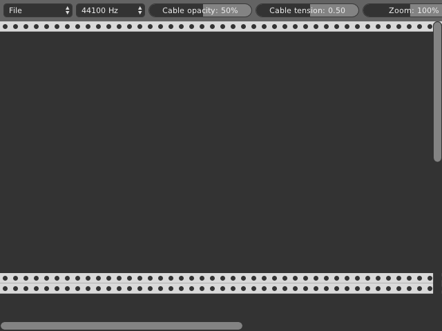
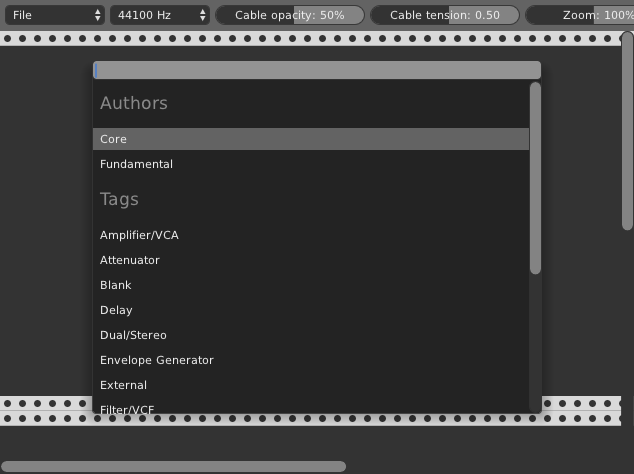
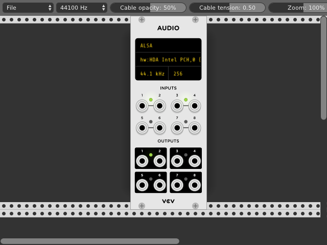
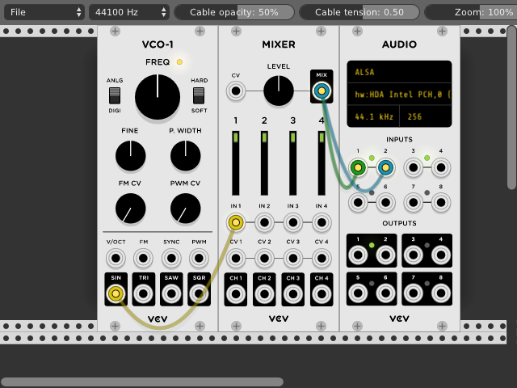

# Quick Start

Once Rack is installed and launched *(see [Installing](Installing.html))*, you will see an empty rack with a toolbar.

Add a module by right-clicking on an empty space on the rack or by pressing `<enter>`.
Select the [Core](Core.html) plugin and then Audio to connect Rack to an audio device on your computer.

You can move the module by clicking and dragging an empty space on its panel.
Select an audio driver and device by clicking on Audio's digital display.

Continue adding more modules, such as VCO-1 and Mixer from the Fundamental plugin.
Connect a cable from the SIN output of the VCO-1 to the input of the Mixer by clicking and dragging from one of the ports.

Connect another cable from the Mixer output to the first channel of Audio's "output" section, and add another cable to the second channel.
You can stack multiple cables on output ports by dragging from an input to an output, or by Ctrl-clicking (Cmd-clicking on MacOS) from an output to an input.

Finally, adjust Mixer's first channel or main volume by clicking and dragging the fader or knob upward/downward.

At this point, you are ready to learn the rest of the Fundamental modules to build your own unique patches.
I personally recommend that you attempt to push the Fundamental modules to their limits before moving on to other official or third-party plugins.
They are more capable than they might appear, and learning how to use them effectively will give you more power and understanding when installing more modules later.
When you are ready, install more plugins with the [Plugin Manager](https://vcvrack.com/plugins.html).
